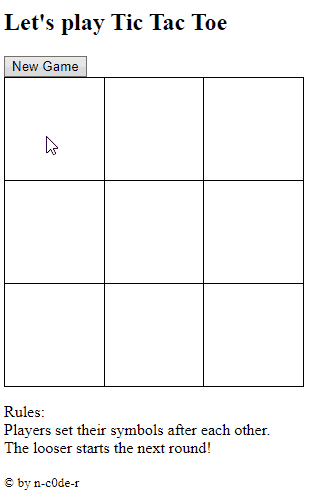

# TicTacToeJS
Homework for web development class. Just a simple click game. Considering to port it to only-CSS version one day. 1st semester, webdesign exercise.

Goal of this exercise was to manipulate the DOM structure in an HTML document, implement basic logics (player turns & game rules), learn basic JavaScript commands, create custom-made functions & perform the correct checks at the right time. 

GIF animation of a JavaScript gameplay of a TicTacToe implementation.

Since then I've seen a lot of different, simple, more complex, elegant, and even pure CSS versions of this in tutorials and blogs. I still try to figure out the pure CSS versions out, but I like mine still a lot. It was my first JS program and a lot of fun to make it.
